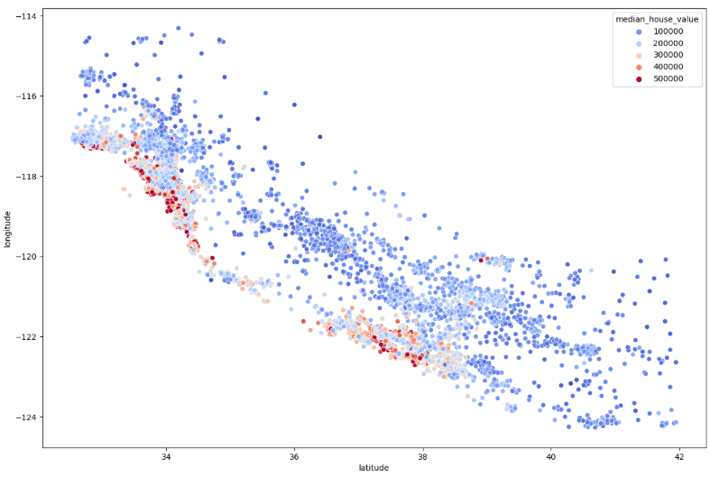
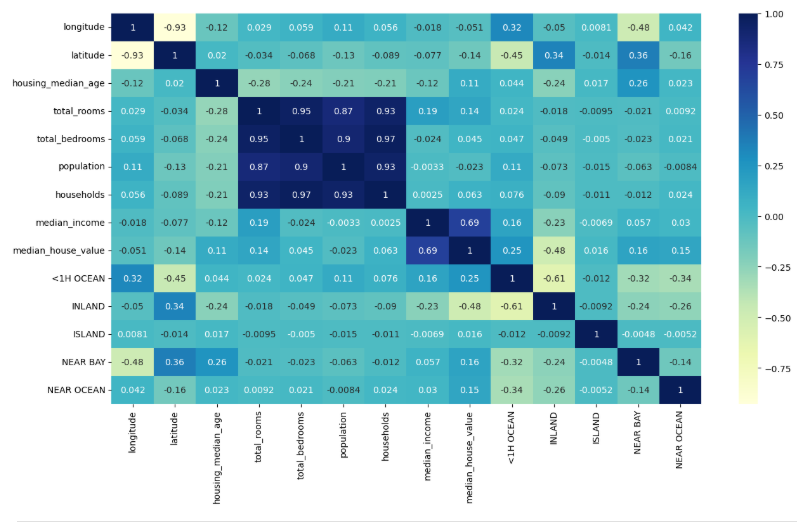

# California Real Estate Analysis

Analysis of California real estate properties, investigating the correlations between variables and house price, and a heatmap representing the mean price.

**Real-Estate Pricing Heatmap**

We can see that coast and bay area generally have a high price, this also corresponds to the major west coast cities known for high real estate prices, SF and LA.

**Correlation Table**

The correlation values lie in between [ -1, 1 ] and values closer to -1 is negative correlation, 0 is no correlation and 1 is positive correlation.

A useful insight from this table is that the main factors for house price is the population of the city it's located in and the number of rooms.

